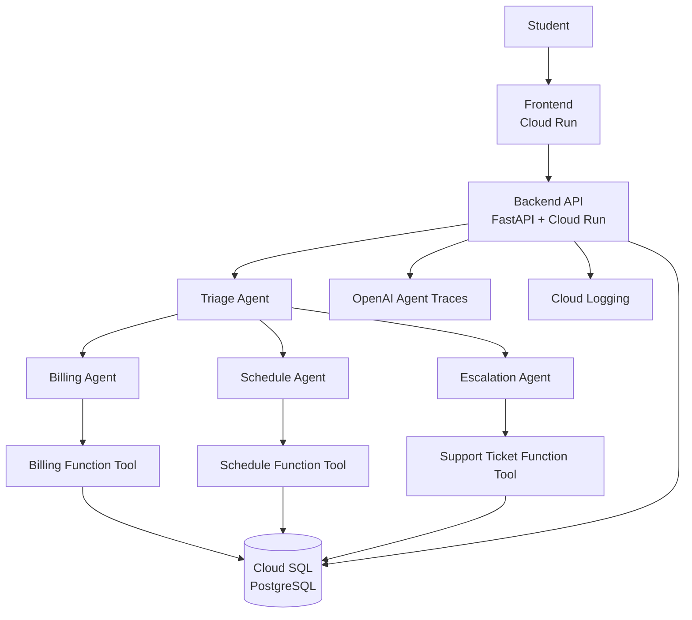
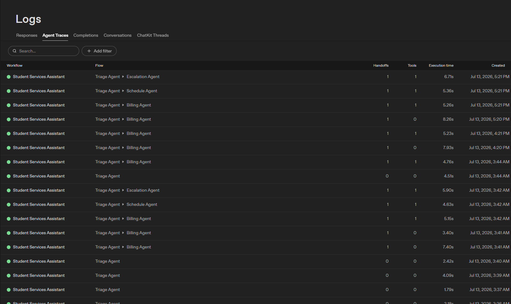
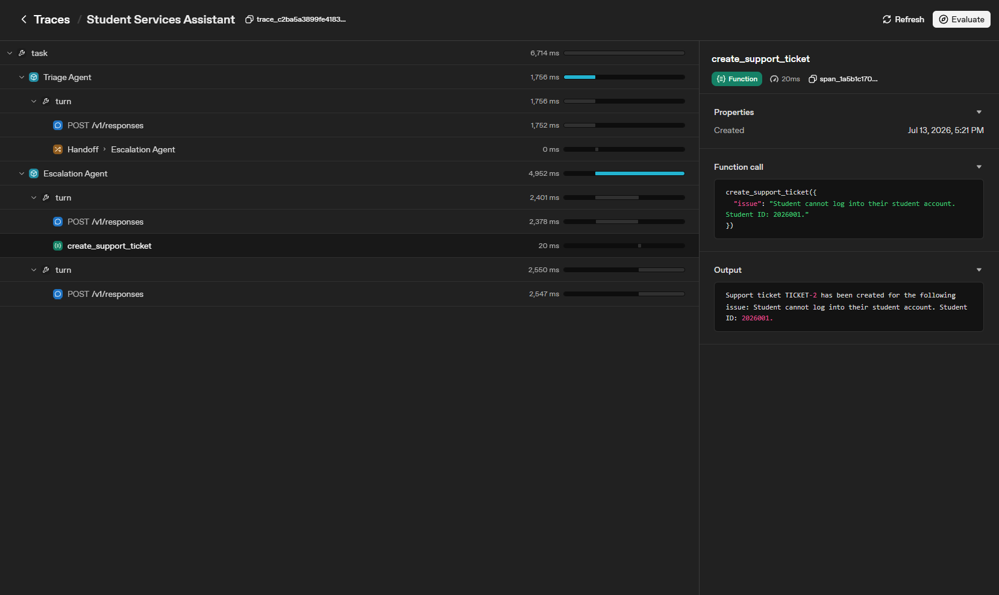
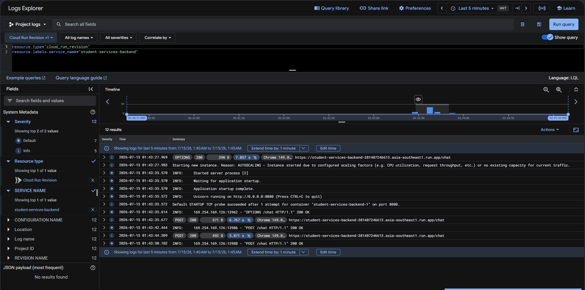

# Multi-Agent Student Services Assistant

A production-style multi-agent AI application built using the OpenAI Agents SDK and deployed on Google Cloud Platform.

This project was developed as the second internship project for Amigda Labs. It demonstrates agent handoffs, structured outputs, persistent conversation memory using PostgreSQL, Cloud Run deployment, Cloud SQL integration, OpenAI tracing, Cloud Logging, and basic infrastructure management with Terraform.

---

## Features

- Multi-agent architecture using the OpenAI Agents SDK
- Triage Agent that routes requests to specialist agents
- Billing Agent for tuition and payment inquiries
- Schedule Agent for class schedules and academic deadlines
- Escalation Agent for support requests
- Persistent conversation threads stored in PostgreSQL
- Thread-based memory shared across agents
- Structured API responses using Pydantic models
- Function tools for billing, schedules, and support ticket creation
- Backend deployed on Cloud Run
- Frontend deployed on Cloud Run
- Cloud SQL PostgreSQL database
- OpenAI Agent Traces
- Google Cloud Logging
- Basic Terraform configuration for GCP infrastructure

---

## Tech Stack

### Backend

- Python 3.11
- FastAPI
- OpenAI Agents SDK
- SQLAlchemy
- PostgreSQL
- Psycopg
- Pydantic

### Frontend

- Next.js
- React
- TypeScript

### Cloud

- Google Cloud Run
- Google Cloud SQL (PostgreSQL)
- Secret Manager
- Cloud Logging

### Infrastructure

- Terraform

---

## Architecture



## System Architecture

The application follows a multi-agent architecture where every user request is first handled by the Triage Agent. Based on the user's intent, the Triage Agent delegates the request to one of the specialist agents.

- **Billing Agent** handles tuition balances, invoices, and payment-related questions.
- **Schedule Agent** retrieves class schedules and academic deadlines.
- **Escalation Agent** creates support tickets for requests that require human assistance.

Each specialist agent uses function tools to retrieve or store information in PostgreSQL. Conversation threads, memory, support tickets, and agent runs are persisted in Cloud SQL, allowing agents to share context throughout a conversation.

The backend is deployed on Google Cloud Run and communicates with a Cloud SQL PostgreSQL instance using SQLAlchemy. OpenAI Agent Traces provide visibility into agent handoffs and tool calls, while Cloud Logging captures backend application logs and request logs.

---

## Project Structure

```text
multi-agent-student-services/
│
├── backend/
│   ├── app/
│   │   ├── agents/
│   │   ├── db/
│   │   ├── models/
│   │   ├── services/
│   │   ├── tools/
│   │   └── main.py
│   ├── Dockerfile
│   └── pyproject.toml
│
├── frontend/
│   ├── app/
│   ├── components/
│   ├── public/
│   ├── Dockerfile
│   └── package.json
│
├── infra/
│   └── terraform/
│       ├── main.tf
│       ├── variables.tf
│       ├── outputs.tf
│       └── README.md
│
└── README.md
```

### Backend

The backend is built with FastAPI and the OpenAI Agents SDK. It is responsible for handling chat requests, orchestrating agent handoffs, executing function tools, managing PostgreSQL persistence, and returning structured responses to the frontend.

### Frontend

The frontend is built with Next.js and React. It provides a simple chat interface for interacting with the Student Services Assistant and communicates with the backend through REST API requests.

### Infrastructure

The `infra/terraform` directory contains the Terraform configuration used to manage Google Cloud resources required for this project. Cloud Run services were deployed using the Google Cloud CLI as permitted by the project requirements.

---

## Multi-Agent Architecture

### Triage Agent

The Triage Agent is the entry point for every conversation. It analyzes each user request and determines whether it should:

- answer the question directly,
- hand off to the Billing Agent,
- hand off to the Schedule Agent,
- or hand off to the Escalation Agent.

The Triage Agent uses the OpenAI Agents SDK handoff mechanism instead of manually routing requests.

---

### Billing Agent

Responsibilities:

- Tuition balance inquiries
- Payment questions
- Invoice requests

Function Tool:

- `get_student_balance()`

Example:

```text
User:
What is my tuition balance?

Billing Agent:
Please provide your student ID.

User:
2026001

Billing Agent:
Your outstanding tuition balance is $1,250.00.
```

---

### Schedule Agent

Responsibilities:

- Class schedules
- Class times
- Academic deadlines

Function Tool:

- `get_student_schedule()`

The Schedule Agent uses conversation memory to reuse a previously provided student ID, eliminating unnecessary prompts during the same conversation.

---

### Escalation Agent

Responsibilities:

- Account issues
- Technical problems
- Human support requests

Function Tool:

- `create_support_ticket()`

When the assistant cannot confidently resolve a request, the Escalation Agent creates a support ticket in PostgreSQL and informs the user that their request has been escalated.

---

## Database Schema

The application uses PostgreSQL hosted on Google Cloud SQL to persist conversations, agent activity, support tickets, and shared memory.

### threads

Represents a single conversation between the user and the assistant.

| Column | Description |
|---------|-------------|
| id | Primary key |
| created_at | Conversation creation timestamp |

---

### thread_items

Stores every message exchanged during a conversation.

| Column | Description |
|---------|-------------|
| id | Primary key |
| thread_id | Associated conversation |
| role | user or assistant |
| content | Message content |
| created_at | Message timestamp |

---

### agent_runs

Stores information about each agent execution.

| Column | Description |
|---------|-------------|
| id | Primary key |
| thread_id | Associated conversation |
| agent_name | Agent that handled the request |
| trace_id | OpenAI trace identifier (when available) |
| created_at | Execution timestamp |

---

### support_tickets

Stores support requests created by the Escalation Agent.

| Column | Description |
|---------|-------------|
| id | Primary key |
| thread_id | Associated conversation |
| ticket_number | Generated support ticket ID |
| issue | User's reported issue |
| status | Ticket status |
| created_at | Creation timestamp |

---

### memory_items

Stores reusable information learned during a conversation.

Examples:

- student_id
- student_name (future enhancement)

The Billing Agent stores the student's ID after it is provided. Other agents can reuse this information, allowing users to continue the conversation without repeatedly entering the same details.

---

## Function Tools

The application uses Function Tools provided by the OpenAI Agents SDK to retrieve or store information.

| Tool | Used By | Purpose |
|------|---------|---------|
| `get_student_balance()` | Billing Agent | Retrieves a student's tuition balance |
| `get_student_schedule()` | Schedule Agent | Retrieves a student's class schedule |
| `create_support_ticket()` | Escalation Agent | Creates a support ticket in PostgreSQL |

Each specialist agent decides when to invoke its function tool based on the user's request. Tool calls are automatically captured in OpenAI Agent Traces.

---

## Structured Output

The backend returns structured responses using a Pydantic model.

Example response:

```json
{
  "answer": "Your outstanding tuition balance is $1,250.00.",
  "category": "billing",
  "handled_by_agent": "Billing Agent",
  "handoff_reason": null,
  "action_items": [],
  "memory_updates": [
    {
      "key": "student_id",
      "value": "2026001"
    }
  ],
  "needs_human": false,
  "thread_id": 1
}
```

Using structured outputs makes the API predictable for frontend applications while allowing agent metadata to be returned alongside the generated response.

---

## Deployment

### Backend

The backend is deployed to **Google Cloud Run** using a Docker container built from the project's `Dockerfile`.

Environment secrets are stored securely in **Google Secret Manager**.

Secrets used:

- `OPENAI_API_KEY`
- `DATABASE_URL`

The backend connects to Cloud SQL using the Cloud SQL Unix socket provided by Cloud Run.

---

### Frontend

The frontend is deployed separately on **Google Cloud Run**.

During deployment, the backend API URL is provided through the following build environment variable:

```text
NEXT_PUBLIC_API_URL
```

The frontend communicates with the backend through REST API requests.

---

### Database

The application uses **Google Cloud SQL PostgreSQL** for persistent storage.

The current Cloud SQL instance uses Google's Cloud SQL free trial configuration. The Enterprise Plus N-8 machine tier and 100 GB storage are preset by the free trial rather than a paid infrastructure upgrade selected for this project. The application uses the trial instance for development and internship review purposes.

The backend stores:

- conversation threads
- thread items
- memory items
- agent runs
- support tickets

Persistent storage allows conversations and memory to survive application restarts.

---

### Secret Manager

Sensitive configuration is stored in Google Secret Manager instead of being committed to the repository.

Examples include:

- OpenAI API Key
- PostgreSQL connection string

No secrets are stored in Git.

---

## Google Cloud Platform Services

This project uses the following Google Cloud services:

| Service | Purpose |
|----------|---------|
| Cloud Run | Deploy backend API |
| Cloud Run | Deploy frontend |
| Cloud SQL PostgreSQL | Persistent relational database |
| Secret Manager | Secure storage for API keys and database credentials |
| Cloud Logging | Application and request logs |
| Artifact Registry | Stores container images |

---

## OpenAI Agent Traces

OpenAI Agent Traces were used to inspect and verify:

- Agent handoffs
- Function tool execution
- Execution timeline
- Workflow performance

The traces confirmed that:

- The Triage Agent successfully handed requests to specialist agents.
- Function tools executed correctly.
- The complete execution flow could be inspected for debugging and review.

Example workflow:

```text
Student
      ↓
Triage Agent
      ↓
Billing Agent
      ↓
get_student_balance()
```

Another example:

```text
Student
      ↓
Triage Agent
      ↓
Escalation Agent
      ↓
create_support_ticket()
```

### Trace Overview

The trace overview shows requests routed from the Triage Agent to the Billing, Schedule, and Escalation Agents. It also displays handoff counts, tool calls, and execution times.



### Detailed Handoff and Tool Call

The detailed trace shows the Triage Agent handing a request to the Escalation Agent, followed by the `create_support_ticket` function tool call.



---

## Cloud Logging

Google Cloud Logging was used to monitor backend activity after deployment.

Cloud Logging captures:

- Cloud Run request logs
- Backend application logs
- Startup logs
- HTTP request status codes
- Runtime errors

Logs were used during development to troubleshoot deployment issues, database connectivity, and API requests.

### Cloud Run Backend Logs

The following logs show successful backend startup and `/chat` requests returning HTTP 200 responses.



---

## Local Setup

### Prerequisites

Before running the project locally, install:

- Python 3.11 or later
- uv
- Node.js
- Docker
- Google Cloud CLI
- Terraform

### Clone the Repository

```bash
git clone <repository-url>
cd multi-agent-student-services
```

### Backend Setup

Navigate to the backend directory:

```bash
cd backend
```

Install the Python dependencies:

```bash
uv sync
```

Create a `.env` file:

```text
OPENAI_API_KEY=your_openai_api_key
DATABASE_URL=your_postgresql_connection_string
```

Run the FastAPI backend:

```bash
uv run uvicorn app.main:app --reload
```

The backend will be available at:

```text
http://127.0.0.1:8000
```

Verify the backend using:

```text
http://127.0.0.1:8000/health
```

Expected response:

```json
{
  "status": "ok"
}
```

### Frontend Setup

Navigate to the frontend directory:

```bash
cd frontend
```

Install dependencies:

```bash
npm install
```

Create a `.env.local` file:

```text
NEXT_PUBLIC_API_URL=http://127.0.0.1:8000
```

Start the frontend:

```bash
npm run dev
```

The frontend will be available at:

```text
http://localhost:3000
```

---

## Terraform

Basic Terraform configuration is located in:

```text
infra/terraform/
```

The Terraform configuration manages required Google Cloud APIs, Secret Manager secret containers, an Artifact Registry repository, a dedicated backend service account, and IAM roles for Cloud SQL and Secret Manager access.

The existing Cloud SQL instance is not managed by Terraform because it was created manually before the Terraform configuration was expanded. Cloud Run services are also deployed separately using the Google Cloud CLI.

### Initialize Terraform

```bash
cd infra/terraform
terraform init
```

### Validate the Configuration

```bash
terraform validate
```

### Review Infrastructure Changes

```bash
terraform plan
```

Terraform state files and variable files containing sensitive values are excluded from Git.

Cloud Run deployment was performed using the Google Cloud CLI instead of Terraform. This kept the initial infrastructure setup focused and avoided introducing additional deployment complexity while learning Terraform fundamentals.

More Terraform documentation is available in:

```text
infra/terraform/README.md
```

---

## AI Usage Log

AI tools were used throughout the project as learning and development assistants.

### AI Tools Used

- ChatGPT
- OpenAI Codex (briefly used during development)

### What AI Helped Generate

- Initial project planning and milestone breakdown
- Explanations of the OpenAI Agents SDK
- Agent instruction improvements
- FastAPI and SQLAlchemy implementation guidance
- PostgreSQL integration guidance
- Docker and Cloud Run deployment guidance
- Terraform setup guidance
- Debugging suggestions
- README documentation structure

### What I Manually Changed or Verified

- Reviewed and tested the agent architecture
- Implemented and verified agent handoffs
- Tested Billing, Schedule, and Escalation Agent behavior
- Verified function tool execution
- Tested PostgreSQL persistence
- Verified thread-based conversation memory
- Fixed Schedule Agent memory behavior
- Configured and deployed the backend and frontend to Cloud Run
- Configured Cloud SQL and Secret Manager
- Inspected OpenAI Agent Traces
- Used Cloud Logging to investigate backend errors
- Initialized and validated the Terraform configuration
- Reviewed generated code and configuration before deployment

### Parts I Still Do Not Fully Understand

I am still developing a deeper understanding of:

- Advanced Terraform state and infrastructure management
- Production-grade IAM design and least-privilege configuration
- Advanced Cloud SQL networking and connection management
- Advanced OpenAI Agents SDK tracing configuration

These are areas I plan to continue studying and practicing.

---

## Cleanup Instructions

The project uses Google Cloud resources that may generate costs.

### Stop the Cloud SQL Instance

To stop the Cloud SQL instance when the application is not being tested:

```bash
gcloud sql instances patch student-services-db --activation-policy=NEVER
```

To start the instance again:

```bash
gcloud sql instances patch student-services-db --activation-policy=ALWAYS
```

Verify the instance state:

```bash
gcloud sql instances describe student-services-db --format="value(state)"
```

### Delete Cloud Run Services

Delete the backend service:

```bash
gcloud run services delete student-services-backend \
  --region asia-southeast1
```

Delete the frontend service:

```bash
gcloud run services delete student-services-frontend \
  --region asia-southeast1
```

### Delete the Cloud SQL Instance

```bash
gcloud sql instances delete student-services-db
```

Deleting the Cloud SQL instance permanently removes the database and its stored application data.

### Terraform State

Terraform state files are excluded from Git and should not be committed.

Before deleting infrastructure managed by Terraform, review the execution plan:

```bash
terraform plan
```

If Terraform manages the target resources, use:

```bash
terraform destroy
```

Do not use `terraform destroy` without reviewing the resources Terraform currently manages.

---

## Future Improvements

- Add student authentication
- Replace mock billing and schedule data with real student service APIs
- Improve IAM configuration using least-privilege service accounts
- Expand Terraform coverage for additional GCP resources
- Add automated backend and frontend tests
- Add CI/CD deployment workflows
- Improve frontend error handling
- Add administrator support ticket management

---

## Project Status

The Multi-Agent Student Services Assistant is deployed and functional.

The project demonstrates multi-agent handoffs, function tools, structured outputs, PostgreSQL persistence, shared conversation memory, Cloud Run deployment, OpenAI Agent Traces, Cloud Logging, and basic Terraform usage.

